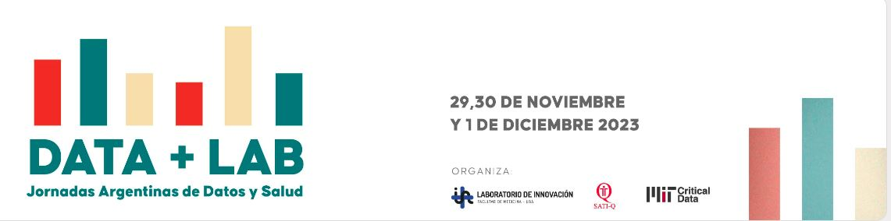

# DATATHON: DESAFIO SIP - El Parto en Datos
*Desafío del Sistema de Información Perinatal*
+ [MAS INFO](https://docs.google.com/document/d/1LQYWznqznqEr6SOr2KeE9AnDkt6unW239ZaOy1tNshQ/edit#heading=h.mdx9b8m4o8bo)

## DESCRIPCIÓN:📊
El Sistema de Información Perinatal (SIP) es un estándar de OPS para el registro clínico de la atención en servicios de salud dirigidos a la mujer, embarazo, parto y recién nacido. 
 
## OBJETIVO DEL DESAFÍO:🏆
+ Describir características generales del parto utilizando las bases de datos del SIP para el año 2021

+ Describir aspectos de la calidad de atención del parto
  - Identificar incumplimiento de la ley de parto humanizado.
  - Identificar situaciones de violencia obstétrica. 
  - identificar brechas en la calidad del parto.

+ Evaluar la calidad del parto y su relación con algunos aspectos de la salud del recién nacido:
  - Analizar calidad del parto y APGAR, necesidad de RCP.
  - Analizar acompañamiento en el parto y APGAR RCP.
  - Factores del parto asociados a una baja puntuación de APGAR
  - Modelo predictivo con datos de parto para APGAR.

+ [MAS INFO](https://docs.google.com/document/d/1LQYWznqznqEr6SOr2KeE9AnDkt6unW239ZaOy1tNshQ/edit#heading=h.mdx9b8m4o8bo)

## COMO RESOLVER LOS DESAFIOS:  :nerd_face:
+ **Definir la pregunta de interés para el grupo:** Justificarla con búsqueda bibliográfica y conocimiento de expertos
+ **Definir las variables necesarias para responderla:** Conocimiento de los expertos- búsqueda bibliográfica
+ **Revisar Diccionario de Datos y Definir las tablas y/o campos de interés:** Con ayuda de los mentores
+ **Definir la herramienta:** R-Phyton-SQL-MSExcel, de acuerdo al expertise de los integrantes
+ **Definir el método que se usará para resolver el desafío:** Estadística descriptiva-Análisis multivariados-Modelos de aprendizaje Automático Supervisados o No Supervisados-etc.

## CONTEXTO:🏥 ⚕️
El Sistema de Información Perinatal (SIP) fue creado por el Centro Latinoamericano de Perinatología – Mujer de la Salud y Reproductiva (CLAP/SMR) de la OPS en 1983.
[CLAP](https://www.paho.org/es/clap)

Entre sus objetivos:

+ servir de base para planificar la atención;
+ verificar y seguir la implantación de prácticas basada en evidencias;
+ unificar la recolección de datos adoptando normas;
+ caracterizar a la población asistida;
+ evaluar la calidad de la atención;
+ realizar investigaciones epidemiológicas operacionales

## PRERREQUISITOS: :hammer_and_wrench:
Para el análisis de los datos se recomienda utilizar alguna de las siguientes plataformas:
+ R-STUDIO:  https://posit.co/download/rstudio-desktop/
+ Visual Code Studio: https://code.visualstudio.com/
+ Google Collab: https://colab.research.google.com/?hl=es

## PRESENTACIÓN DE RESULTADOS:📑
+ Se espera que cada equipo, realice una presentación de no más de 5 diapositivas, para exponer en no más de 5 minutos. Pueden descargar un *template modelo* para utilizar desde [AQUI](https://docs.google.com/presentation/d/1ifhpMzLD_AxdloG18gg8UqpvwOgekhl-/)
+ Compartir los códigos fuentes generados, dentro de la carpeta correspondiente a cada equipo. 

## ESTRUCTURA DE DATOS: :card_index:
**Variables independientes**
+ Edad materna- Alfabeta-Estudios
+ Estado civil-Vive sola-Lugar de control prenatal- Lugar de parto-Violencia

**Parto humanizado**
+ Parto-Aborto-Consultas prenatales-Hospitalización-Inicio de parto(espontáneo-inducido-cesárea) Corticoides-Acompañante parto/trabajo de parto- Analgesia- Anestesia local , general , regional , etc

**Neonatología**
+ Sexo-Antropometría
+ APGAR 1- 5 min- Reanimación y tipo-Fallece- Atendió parto    Atendió neonato( médico-obstetra-enfermera- auxiliar- estudiante empírico)- Defectos congénitos

**Criterios de anonimización de cuasi-identificadores**
+ VARIABLE: Residencia - Ocurrencia del parto / TRANSFORMACIÓN: Se MODIFICA A DEPARTAMENTOS
+ VARIABLE: Efector de ocurrencia / TRANSFORMACIÓN: Se MODIFICA A TIPOLOGIA DE ESTABLECIMIENTO
+ VARIABLE: Edad Materna / TRANSFORMACIÓN: Se establecen grupos de edad
+ VARIABLE: Fecha de parto / TRANSFORMACIÓN: Se MANTIENE MES y DIAS DE INTERNACION

## REPOSITORIO DE DATOS: 📁
A los fines de este desafío se ponen a disposición:
+ [DICCIONARIO DE DATOS](https://docs.google.com/document/d/1LQYWznqznqEr6SOr2KeE9AnDkt6unW239ZaOy1tNshQ/edit#heading=h.mdx9b8m4o8bo)

+ [TABLAS Y REPOSITORIO DE DATOS:](https://drive.google.com/file/d/1UzORQT1C6jnmzCXtDAYgmuLcCUQp46H1/view)

+ [Acuerdo de Uso de Datos:](https://docs.google.com/document/d/1MDfF8Ew9lH8LbKyA7DTjGl9ZMKyBvKxB/edit)

## BIBLIOGRAFIA COMPLEMENTARIA 📚

**Libro**:  [Análisis Secundario de Historias Clínicas Electrónicas](https://www.hardineros.ar/analisis-secundario-de-historias-clinicas-electronicas)

*Versión traducida al español de la obra Secondary Analysis of Electronic Health Records*

Autores: Leo A Celi - MIT CRITICAL DATA; Equipo de traducción dirigido por Ariel Fernández, Maria del Pilar Arias y Juan Sebastián Osorio

## EJEMPLOS DE CÓDIGO Y MATERIAL AUXILIAR 🧰

Libreriás de Phyton más utilizadas en Ciencia de datos y documentación: 

1-Pandas [https://pandas.pydata.org/docs/user_guide/index.html ]. Libreria de manipulación y análisis de datos estructurados

2-Numpy [https://numpy.org/doc/stable/user ]. Es una libreria de Algebra Lineal (Vectores y Matrices)

3-Matplotlib [https://matplotlib.org/ ]. Libreria de visualización

4-Seaborn [https://seaborn.pydata.org/]. Libreria de visualización

5-Plotly. [https://plotly.com/python-api-reference/]. Libreria de visualización

6- Scikit learn.[https://scikit-learn.org/stable/]. Libreria para aprendizaje automático ( regresión, clasificación, clustering, preprocesamiento, etc)

7- Recursos utiles en R. [https://posit.co/resources/cheatsheets/]
